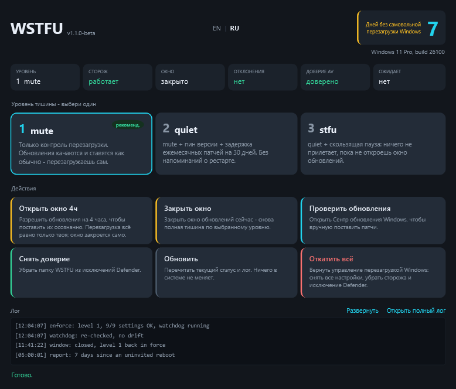

<p align="center">
  
</p>

<p align="center"><b>Windows, Shut The F**k Up.</b><br>
Твой ПК перезагружается тогда, когда <i>ты</i> скажешь.</p>

<p align="center">
  <a href="../../actions/workflows/ci.yml"></a>
  
  
  
</p>

<p align="center"><a href="README.md">English</a> · <b>Русский</b></p>

---

## Проблема

Раз в неделю-две Windows сама решает, что сейчас — удачный момент перезагрузиться:
после обновления, посреди работы или ночью. С машиной всё в порядке — просто
решение о перезагрузке принадлежит не тому, кто за ней работает. WSTFU забирает
его обратно и **удерживает**, потому что настройку, которую ты выставил руками,
следующее обновление тихо возвращает назад.

<p align="center">
  
</p>

## Что делает

Ты выбираешь уровень «громкости». WSTFU применяет его и ставит фоновый **сторож**,
который при загрузке и каждые 10 минут заново всё сверяет, откатывает любое
сбитое значение и пересоздаёт свою задачу, если её удалили.

| Уровень | Имя | Что делает | Чем платишь |
|:-------:|-----|------------|-------------|
| 1 | `mute` **(по умолчанию)** | Только контроль перезагрузки. Обновления качаются и ставятся. | Ожидающая перезагрузка ходит за тобой, пока не сделаешь сам. |
| 2 | `quiet` | `mute` + пин версии + задержка ежемесячных обновлений на 30 дней + без напоминаний о рестарте. | Фикс активно эксплуатируемой дыры тоже ждёт 30 дней. |
| 3 | `stfu` | `quiet` + скользящая пауза: ничего не прилетает, пока не откроешь окно. | Патчей безопасности нет, пока не откроешь окно — ок для рабочей станции, не для разъездного ноутбука. |

На любом уровне **контроль перезагрузки включён всегда** — остальное только про то,
*когда* обновлениям появляться. [Что именно меняет каждый уровень →](docs/levels.md)

## Установка

Нужны **Windows 10 / 11 Pro, Enterprise, Education или IoT LTSC**. (Home эти
политики игнорирует.) Ставить нечего — работает на PowerShell, который уже есть в
Windows.

### Проще всего: двойной клик по `Run WSTFU.cmd`

Откроется небольшая панель управления. Видно текущее состояние, уровень ставится
в один клик, там же окно обновлений и откат — всё кнопками. Подтверди запрос
администратора, когда попросит. Собственно, и всё.

> **Не подписано.** У WSTFU пока нет сертификата подписи кода, поэтому Microsoft
> Defender и SmartScreen могут предупреждать или помечать прогу — не как вирус, а
> потому что именно подпись говорит Windows, кому доверять, а её нет. Если
> заблокировал — внеси в исключения Defender две папки: **`C:\ProgramData\WSTFU`**
> (сюда ставится и отсюда работает) и **папку, куда распаковал**, — и запусти
> снова. Точные шаги — в разделе [Defender](#defender).

### Любишь консоль?

То же самое, без окна:

```powershell
.\wstfu.ps1 status      # только чтение, ничего не меняет — запусти первым
.\wstfu.ps1 shutup      # спросит уровень, применит, поставит сторожа
```

`status.cmd`, `shutup.cmd` и `speak.cmd` — двойной клик сразу на это действие.

## Команды

| Команда | Что делает |
|---------|------------|
| `wstfu.ps1 status` | Отчёт только для чтения: настройки, сторож, история перезагрузок. По умолчанию. Ничего не меняет. |
| `wstfu.ps1 shutup [-Level 1\|2\|3]` | Применить уровень и поставить сторожа. |
| `wstfu.ps1 window 4h` | Открыть окно обслуживания, чтобы поставить обновления осознанно. Контроль перезагрузки остаётся; закрывается само. |
| `wstfu.ps1 close` | Закрыть окно сейчас. |
| `wstfu.ps1 report` | Показать недельное саммари тостом сейчас. |
| `wstfu.ps1 trust` / `untrust` | Добавить / убрать исключение папки WSTFU в Defender. |
| `wstfu.ps1 dashboard` | Небольшое окно-панель (живой статус, смена уровня, окно, откат, EN/RU). |
| `wstfu.ps1 speak` | Отменить всё — назад к дефолту Microsoft. |

Длительность — `30m`, `4h`, `2d` или просто число (часы). Раз в неделю WSTFU
роняет тост с той самой цифрой: **сколько дней Windows не перезагружал твой ПК без
спроса.**

## Обновляться осознанно

Смысл в том, что ты по-прежнему патчишь машину — когда удобно:

```powershell
.\wstfu.ps1 window 4h    # обновления разрешены на 4 часа; контроль перезагрузки остаётся
# Параметры > Центр обновления > Проверить, поставить, потом перезагрузиться самому
.\wstfu.ps1 close        # или просто дать окну истечь
```

Внутри окна Windows всё равно не может перезагрузить машину сам. Никогда.

## Честные лимиты

- **Ничего здесь не неубиваемо, и не должно быть.** Локальный админ, `SYSTEM` и
  `TrustedInstaller` по устройству ОС выше любого сервиса. WSTFU защищает от
  *автоматического* отката (обновление, чистящая утилита), возвращая настройки в
  течение 10 минут — от тебя машину он не запирает.
- **Windows Home не поддерживается** — эти политики он игнорирует полностью.
- **Часть задач перезагрузки защищена** и откажет даже админу с повышением;
  `status` показывает это честно. Нагрузку несёт реестровая политика.
- **Активные часы не покрывают 24ч** (Windows ограничивает 18), поэтому вне
  05:00–23:00 работают анти-ребут политики.
- **Доменная групповая политика побеждает.** На машине в домене — вне области.
- **Уровень 3 — непропатченная машина**, пока не откроешь окно: осознанный,
  обратимый размен для станции вне публичной сети.

## Defender

Defender может пометить WSTFU как *потенциально нежелательное приложение* — потому
что отключение задач перезагрузки — поведение, которому его эвристика не доверяет,
а не потому что это вирус. Репутабельные инструменты такого рода получают ту же метку.

- `shutup` пытается исключить свою папку сам. Это работает, только пока Defender
  запущен **и** Tamper Protection выключена.
- Если отказал — добавь один раз руками: **Безопасность Windows → Защита от вирусов
  и угроз → Управление настройками → Исключения → Добавить папку →
  `C:\ProgramData\WSTFU`** (и папку, откуда запускаешь скрипт).
- Если Defender уже отправил файл в карантин: **Журнал защиты → Восстановить**,
  затем добавить исключение и ставить.
- С исключённой папкой установленная копия остаётся нетронутой — сейчас и после
  будущих обновлений сигнатур. Копия вне исключённой папки — нет; поведенческий
  мониторинг подавлен в основном, но не на 100% — страховка это сторож.

**WSTFU никогда не выключает Defender и не будет.** Выключить антивирус — это то,
что делает малварь; Tamper Protection всё равно это блокирует, а машина осталась бы
без защиты. Максимум — исключение, и `speak` / `untrust` возвращают всё назад.

## Удаление

```powershell
.\wstfu.ps1 speak
```

Убирает все записанные значения, включает обратно задачи перезагрузки, удаляет
сторожа и снимает исключение Defender.

## Разработка

```powershell
Invoke-Pester ./tests
Invoke-ScriptAnalyzer -Path . -Recurse -Settings ./PSScriptAnalyzerSettings.psd1
```

CI гоняет оба на `windows-latest`. Политика — это данные, а не код: одна таблица в
`Get-WstfuPlan`, а apply / verify / report / revert — четыре прохода по ней, так
что добавить настройку значит добавить строку.

## Лицензия

MIT — см. [LICENSE](LICENSE).
